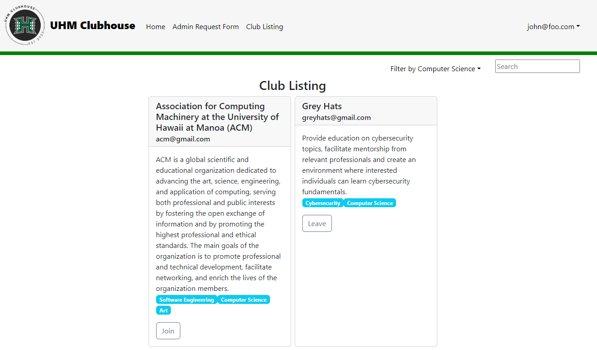
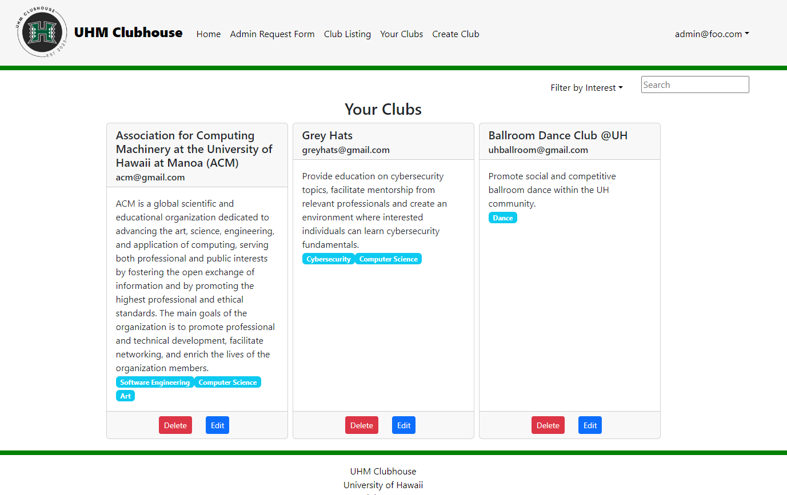
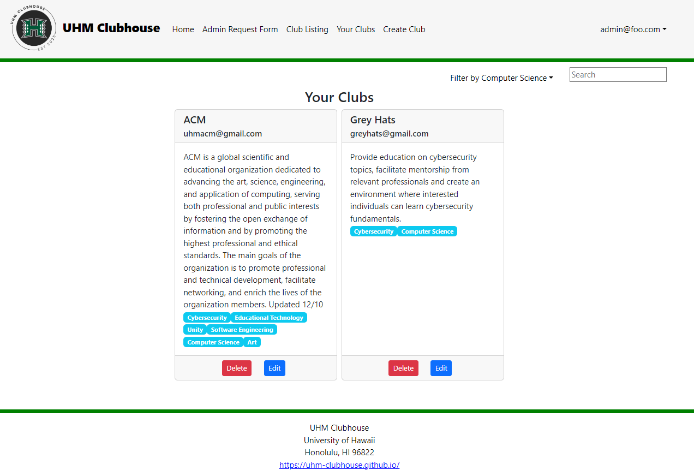
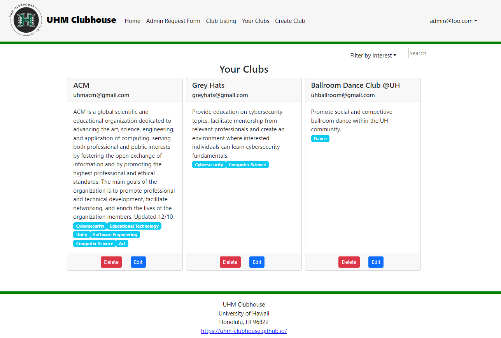
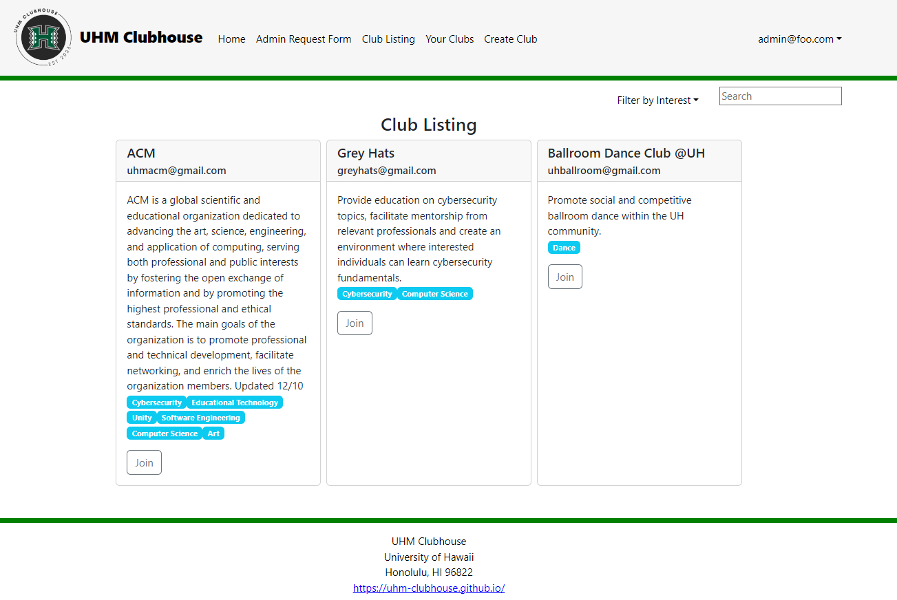
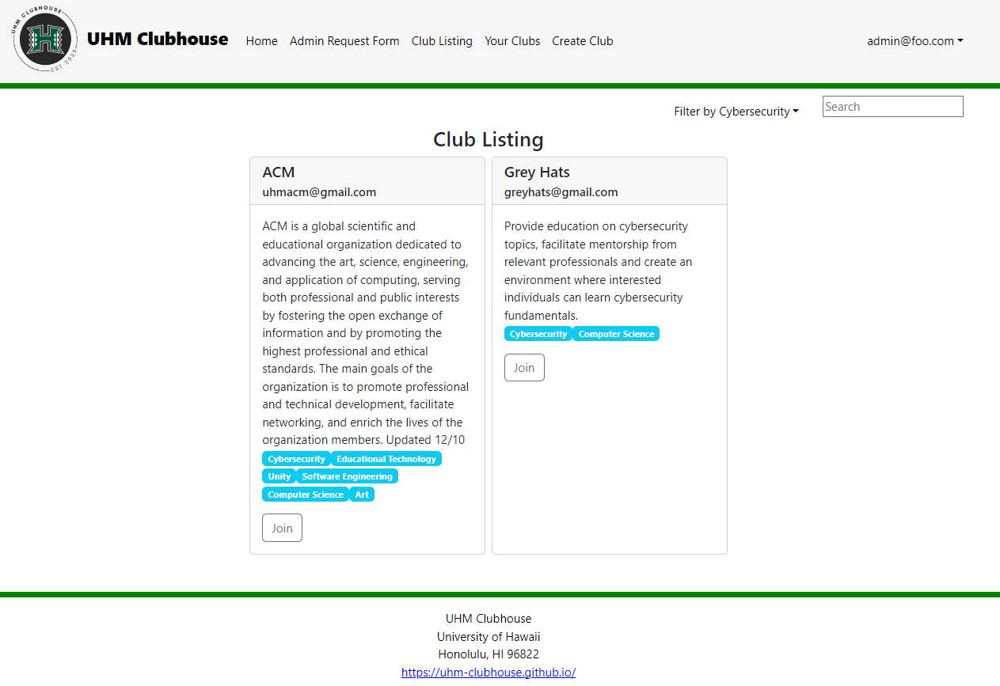
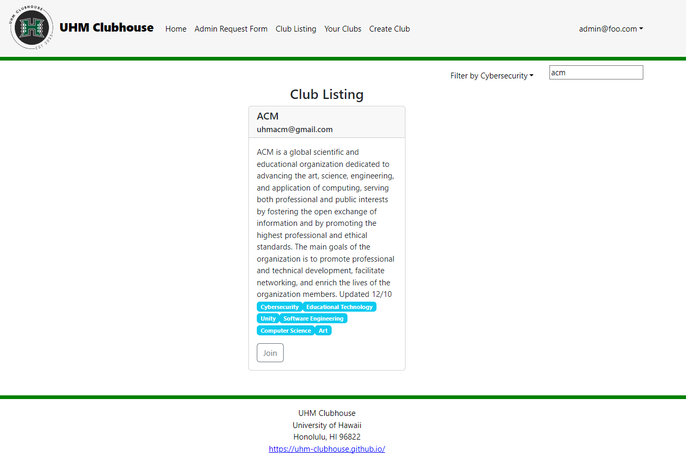

# UHM Clubhouse

## Table of contents

* [Overview](#overview)
* [Features](#features)
* [User Guide](#user-guide)
* [Community Feedback](#community-feedback)
* [Deployment](#deployment)
* [Developer Guide](#developer-guide)
* [Continuous Integration](#continuous-integration)
* [Development History](#development-history)
* [Team](#team)

## Overview 
Finding and learning about available student clubs at UH Manoa is a difficult task that the UHM Clubhouse intends to solve. The UHM Clubhouse is an application for students to browse an organized directory of all current student clubs with brief descriptions, meeting information, and contact information.

## Features
* Three distinct user roles
  * Regular users can enjoy a seamless browsing experience of the directory
  * Club admins wield the power to edit their club's data
  * Super admins play the crucial role of ensuring site content appropriateness and bestowing "club admin" privileges upon chosen users
* Browsing page
  * Filter clubs based on interest areas, such as "athletic," "art," and "music"
  * Search for clubs using keywords that match the club names or descriptions
  * A club can belong to multiple interest areas
* Following page
  * Users can view the clubs they joined on their home page
    * Users can leave or join the club at any time
* Admin request form
  * Users can request to be an admin by submitting their email
* Admin responsibilities
  * Review site content to ensure it is appropriate
  * Create, delete, or edit a club at any time
* Super admin responsibilities
  * View and approve of requests made by users to become an admin

## User Guide
This section provides a walkthrough of the UHM Clubhouse user interface and its capabilities.

#### Landing Page
The landing page is the very first page presented to all users who are not logged in. Users can learn about the UHM Clubhouse application and log in or sign up.

#### Profile Creation and Login Page
This is where users can input their email and password to create a new account. Existing users can also log in by clicking the "Login" button in the top right corner to input their email and password.

Login Page:

Profile Creation Page:

#### User Home Page
This home page is presented to users who are logged in. The user's joined club information is shown in the center of the page, along with a sidebar containing a list of the clubs the users are following. Users can also access the "Club Listing" and "Admin Request Form" links in the navigation bar at the top of the page.

#### Club Listing Page
This page is the listing page, where users can browse and join all the available clubs that are posted. Clubs can be filtered by interest or searched using the search bar.

Filter function:

Search function: 

#### Admin Request Form Page
This page is the admin request form, where users can request to become a club admin to create and manage their clubs.

#### Club Admin Home Page
Users with the Club Admin role can view their club postings and edit the club information.

Club admin users can also search for their club postings by the search bar or filter by interest.

Filter Function:

Search Function:

#### Super Admin Home Page
Users with the Super Admin role are responsible for ensuring the site content is appropriate and can delete a club posting at any time. Additionally, they can grant "Club Admin" privileges to selected users via the link in the navigation bar.

## Community Feedback
After deploying the application, the team asked for feedback from the UH community using a Google Form found [here](https://forms.gle/AQyRCnFNsQDmtRi17). Below are some feedback we received from the community:

* "The home page was a very simple and informative home page that clearly described the steps on how to use the website. A possible way to make the homepage better is to have a small slideshow on the step-by-step instructions instead of having the steps all laid out. The descriptions were simple and taught me how to maneuver the website."
* "...whenever you join a club you could add in a more visible way of seeing that you joined a club"
* "Simple and straightforward but you should add more pictures to represent the clubs"
* "Perfect"
* "It was easy to look through. Straight to the point and informative, nothing there to distract from the purpose of the website."

We also asked them to rate the usability and practicality of our application on a scale of 1 to 5 (1 being the worst and 5 being the best):

## Deployment
We’ve deployed our application, which can be found [here](https://uhm-clubhouse.xyz/)

## Developer Guide

## Installation
1. Install [Meteor](https://www.meteor.com/install).

2. Download a copy of [UHM Clubhouse](https://github.com/uhm-clubhouse/uhm-clubhouse) 
3. After downloading, cd into the app directory and install the required libraries:

    ``
    $ cd app
    ``

    ``
    $ meteor npm install
    ``
4. Once the libraries are installed, run the system by invoking
    ``
    $ meteor npm run start
    ``
5. If all goes well, the application will appear at http://localhost:3000

## Continuous Integration

UHM Clubhouse uses GitHub Actions to automatically run ESLint and TestCafe each time a commit is made to the default branch. You can see the results of all recent “workflows” at https://github.com/uhm-clubhouse/uhm-clubhouse/actions.

The workflow definition file is quite simple and is located at [github/workflows/ci.yml](https://github.com/uhm-clubhouse/uhm-clubhouse/blob/main/.github/workflows/ci.yml)

### Development History
Below, we have included our continuous integration of the application through three milestones:

### [Milestone 1](https://github.com/orgs/uhm-clubhouse/projects/2)
* Create mockups for the user interface
* Setting up project home page
* Create default data
* Creating necessary documentation and presentations

  #### Planned Designs:

    Landing:
    
    
    Sign-in and Login:
    
    
    User Home Page:
    

    Club Listing Page:
    
    
    Club Creation Page:
    

    Club Admin Home Page:
    

    Super Admin Home Page:
    

  #### Updated user interface:

    Landing:
    
    
  
    Sign-in and Login:
    
  
    User Home Page:
    
  
    Club Listing Page:
    
  
    Club Creation Page:
    
  
    Club Admin Home Page:
    

### [Milestone 2](https://github.com/orgs/uhm-clubhouse/projects/5)
* Have pages load default data
* Edit the design of each page to match mockups
* Have the Create Club form write data to the database
* Deploy four pages in addition to the landing page
* Implement continuous integration
* Test all deployed pages using TestCafe

  #### Updated user interface:

  Landing:
  

  User Home Page:
  

  Club Listing Page:
  

  Club Creation Page:
  
  The form is submittable:
  
  Upon submitting a form, data is written to the database:

    ClubsCollection:
  

  ClubsInterestsCollection:
  

  Club Admin Home Page:
  

  Edit Clubs:
  
  

  Super Admin Home Page:
  
  Set Admin:
  

### [Milestone 3](https://github.com/orgs/uhm-clubhouse/projects/6)
* Improve the functionality of the system
* Clean up the user interface
* Additional testing of the system

  #### Updated user interface:

    Landing Page:
  * Updated logo and user interface
  

    User Home Page:
  * Shows users their joined clubs
  * Added a join and leave club function
  
  
 
    Admin Request Form
  * Allows users to request to become a club admin via email address
  
    The request form is submittable:
  

    Club Listing Page:
  * Added a filter and search function
  * Added a leave club function
  
  
  

    Your Clubs Page for Admins:
  * Added a filter and search function
  * Added a delete club function
  

    Edit Club Page for Admins:
  
    After editing club information, the form is submittable:
  
    Edited club information appears on the "Your Clubs" page with filter and search functions working with the edited club:
  
  
  
    Edited club information appears on the "Club Listing" page with filter and search functions working with the edited club:
  
  
  

    Admin Requests Page for Super Admins only:
  * Shows what accounts are requesting to be admins
  * Added a hide function to hide any admin requests
  
     
## Team
UHM Clubhouse is designed, implemented, and maintained by [Miki Kojima](https://github.com/miki-x2), [Keiko Raiola](https://github.com/keikotr), [Iverson Yago](https://github.com/iversony1), [Lizyl Failano](https://github.com/lizylf), [Delsin Rhoney](https://github.com/DelsinRhoney), [Chad Vilayvong](https://github.com/Chadv2).

These members have signed a contract for this organization, which can be viewed [here](https://docs.google.com/document/d/17iacQBDx85FvQOAC1Jws0_lws82LN-tlW3v9oX7Rp2A/edit?usp=sharing).

