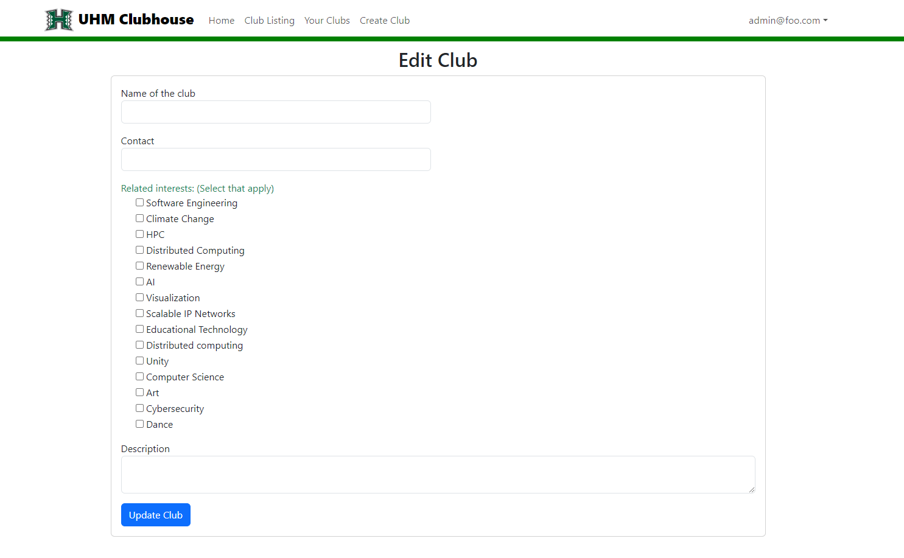

# UHM Clubhouse

## Table of contents

* [Overview](#overview)
* [Features](#features)
* [User Interface](#user-interface)
* [Deployment](#deployment)
* [Continuous Integration](#continuous-integration)
* [Development History](#development-history)
* [Team](#team)

## Overview 
Finding and learning about student clubs that are available at UH Manoa is a difficult task that the UHM Clubhouse intends to solve. The UHM Clubhouse is an application for students to browse an organized directory of all current student clubs with brief descriptions, meeting information, and contact information.

## Features
* Three distinct user roles
  * Regular users can enjoy a seamless browsing experience of the directory
  * Club admins wield the power to edit their club's data
  * Super admins play the crucial role of ensuring site content appropriateness and bestowing "club admin" privileges upon chosen users
* Browsing page
  * Filter clubs based on interest areas, such as "athletic," "art," and "music." 
  * A club can belong to multiple interest areas
* Notifications
  * Users receive notifications based on their interest areas
    * New club that matches to their preferences
    * When an existing club adds an interest area relevant to the user
* Admin responsibilities
  * Review site content to ensure it is appropriate
  * Introduce new categories, such as musical tastes, capabilities, and goals

## User Interface
This section provides a walkthrough of the UHM Clubhouse user interface and its capabilities.

#### Landing Page
The landing page is the very first page presented to all users who are not logged in. Users can learn about the UHM Clubhouse application and log in or sign up.

#### Profile Creation and Login Page
This is where users can input their first and last name, email, and password to create a new account. Existing users can also log in by clicking the "Login" button in the top right corner to input their email and password.

#### User Home Page
This home page is presented to users who are logged in. Recent updates are shown in the center of the page, along a sidebar containing a search bar and a list of the clubs the users are following. Users can also access the "Club Listing" and "Create Club" links in the navigation bar on the top of the page.

#### Club Listing Page
This page is the listing page, where users can browse all the available clubs that are posted. Specific clubs can be searched through the searchbar and club listings can be filtered to fit the user's needs.

#### Club Creation Page
This page is the club creation page, where users can create a posting for their club. 

#### Club Admin Home Page
Users with the Club Admin role can view all of their club postings and can edit the data associated with their club.

#### Super Admin Home Page
Users with the Super Admin role are responsible for making sure the site content is appropriate and can delete a club posting at any time. Additionally, they can grant "Club Admin" privileges to selected users via the link in the navigation bar.

## Deployment
We’ve deployed our application, which can be found [here](https://uhm-clubhouse.xyz/)
### Installation
1. Install [Meteor](https://www.meteor.com/install).

2. Download a copy of [UHM Clubhouse](https://github.com/uhm-clubhouse/uhm-clubhouse) 
3. After downloading, cd into the app directory and install the required libraries:

    ``
    $ cd app
    ``

    ``
    $ meteor npm install
    ``
4. Once the libraries are installed, run the system by invoking
    ``
    $ meteor npm run start
    ``
5. If all goes well, the application will appear at http://localhost:3000

## Continuous Integration

UHM Clubhouse uses GitHub Actions to automatically run ESLint and TestCafe each time a commit is made to the default branch. You can see the results of all recent “workflows” at https://github.com/uhm-clubhouse/uhm-clubhouse/actions.

The workflow definition file is quite simple and is located at [github/workflows/ci.yml](https://github.com/uhm-clubhouse/uhm-clubhouse/blob/main/.github/workflows/ci.yml)

## Development History
### [Milestone 1](https://github.com/orgs/uhm-clubhouse/projects/2)
* Create mockups for the user interface
* Setting up project home page
* Create default data
* Creating necessary documentation and presentations

  #### Planned Designs:

    Landing:
    
    
    Sign-in and Login:
    
    
    User Home Page:
    

    Club Listing Page:
    
    
    Club Creation Page:
    

    Club Admin Home Page:
    

    Super Admin Home Page:
    

  #### Updated user interface:

    Landing:
    
    
  
    Sign-in and Login:
    
  
    User Home Page:
    
  
    Club Listing Page:
    
  
    Club Creation Page:
    
  
    Club Admin Home Page:
    

### [Milestone 2](https://github.com/orgs/uhm-clubhouse/projects/5)
* Have pages load default data
* Edit the design of each page to match mockups
* Have the Create Club form write data to the database
* Deploy four pages in addition to the landing page
* Implement continuous integration
* Test all deployed pages using TestCafe

  #### Updated user interface:

  Landing:
  

  User Home Page:
  

  Club Listing Page:
  

  Club Creation Page:
  
  The form is submittable:
  
  Upon submitting a form, data is written to the database:

    ClubsCollection:
  

  ClubsInterestsCollection:
  

  Club Admin Home Page:
  

    Edit Clubs:
  
  

    Super Admin Home Page:
  
    Set Admin:
  

### [Milestone 3](https://github.com/orgs/uhm-clubhouse/projects/6)
* Improve the functionality of the system
* Clean up the user interface
* Additional testing of the system

     
## Team
UHM Clubhouse is designed, implemented, and maintained by [Miki Kojima](https://github.com/miki-x2), [Keiko Raiola](https://github.com/keikotr), [Iverson Yago](https://github.com/iversony1), [Lizyl Failano](https://github.com/lizylf), [Delsin Rhoney](https://github.com/DelsinRhoney), [Chad Vilayvong](https://github.com/Chadv2). 

These members have signed a contract for this organization, which can be viewed [here](https://docs.google.com/document/d/17iacQBDx85FvQOAC1Jws0_lws82LN-tlW3v9oX7Rp2A/edit?usp=sharing).

